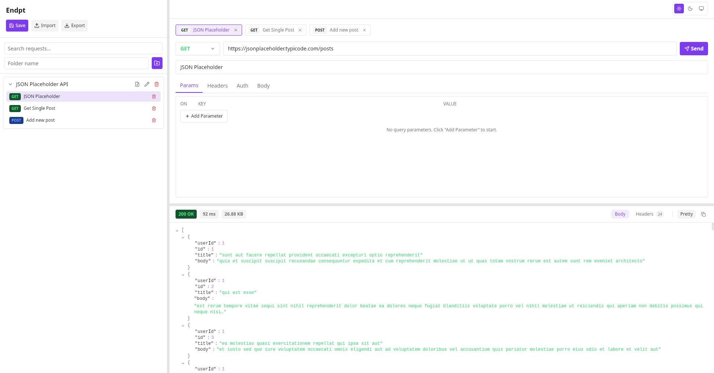

# Endpt

[](https://github.com/bipulhf/endpt/releases)
[](https://github.com/bipulhf/endpt/actions/workflows/release.yml)
[](LICENSE)


Endpt is a high-performance desktop API client built with Tauri v2, React, TypeScript, and Rust.

## Overview

Endpt is designed as a lightweight Postman/Insomnia alternative with a Rust-powered networking layer. HTTP requests run in the Tauri backend through reqwest, which avoids browser webview CORS limitations and provides consistent desktop behavior across Linux, Windows, and macOS.

## Screenshot



## Core Features

- Rust backend request execution via reqwest
- Workspace model: folders and API requests
- Request editor with method, URL, headers, and body controls
- Body mode support:
	- none
	- json
	- raw (text/json/xml/html/javascript)
	- form-data (text + file parts)
	- x-www-form-urlencoded
	- binary file body
	- graphql (query + variables)
- Response pane with:
	- status code and label
	- request duration (ms)
	- response size (bytes)
	- pretty/raw body toggle
	- copy response body
- Import/export workspace JSON via Rust filesystem commands
- Theme support: light, dark, system
- Resizable layout panels (sidebar/editor/response)
- Request tabs and sidebar search/filter
- Toast notifications for key actions (send/import/export/copy/errors)

## Tech Stack

### Frontend

- React 19
- TypeScript 5
- Vite 7
- Tailwind CSS 3
- Zustand
- Sonner
- Radix UI primitives
- react-resizable-panels

### Backend

- Tauri v2
- Rust
- reqwest
- tokio
- serde / serde_json

### Testing

- Vitest + Testing Library (frontend)
- cargo test (backend)

## Project Structure

```text
.
├── src/
│   ├── components/
│   ├── services/
│   ├── store/
│   └── types/
├── src-tauri/
│   ├── src/
│   │   ├── commands/
│   │   ├── models/
│   │   └── lib.rs
│   └── tauri.conf.json
├── main_logo.png
└── README.md
```

## Getting Started

### Prerequisites

- Node.js 18+
- npm
- Rust toolchain (stable)
- Tauri system dependencies for your OS

Official setup guide: https://tauri.app/start/prerequisites/

### Install

```bash
npm install
```

### Run in Development

```bash
npm run tauri dev
```

## Available Scripts

| Command | Description |
|---|---|
| `npm run dev` | Start Vite dev server |
| `npm run build` | Type-check and build frontend |
| `npm run typecheck` | Run TypeScript checks |
| `npm run test` | Run frontend unit tests |
| `npm run preview` | Preview frontend build |
| `npm run tauri dev` | Run desktop app in dev mode |
| `npm run tauri build` | Build production desktop bundles |

## Backend Tests

```bash
cd src-tauri
cargo test
```

## App Icon Generation

Use a square PNG source image (recommended 1024x1024) and generate all platform icons:

```bash
npm run tauri icon src-tauri/icons/app-icon.png
```

The generated icon files are referenced by src-tauri/tauri.conf.json.

## Build for Release

```bash
npm run tauri build
```

This creates platform-specific application bundles/installers under src-tauri/target/release/bundle.

## Maintainer

- Name: Bipul Hf
- Email: bipulhf@gmail.com
- GitHub: https://github.com/bipulhf
- Repository: https://github.com/bipulhf/endpt

## Recommended IDE Setup

- VS Code
- Tauri VS Code extension
- rust-analyzer extension
